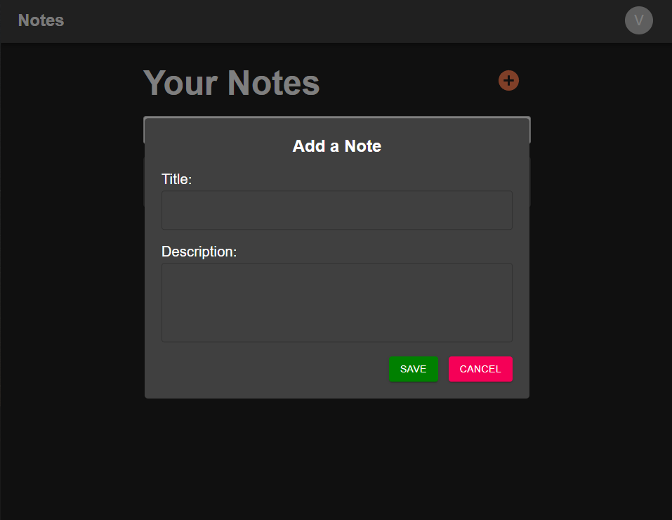
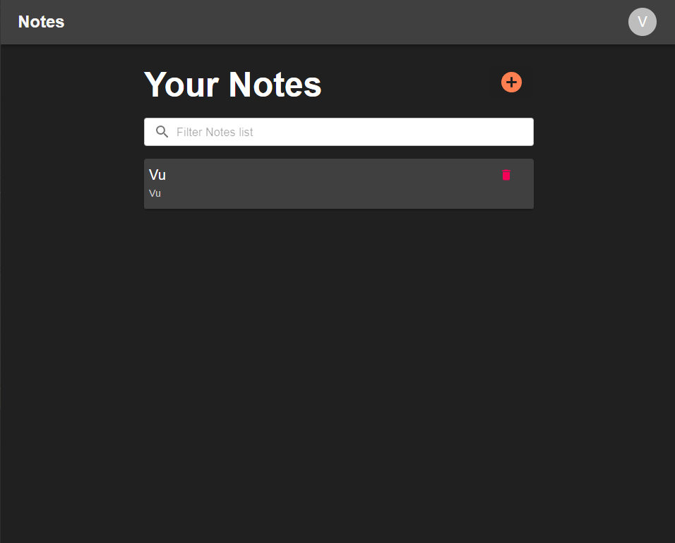

<div align="center">

# Notes-App
</div>
<a href='https://main.d5h9pd5jh16g1.amplifyapp.com/'>Visit the deployed app</a>

### Cloning the repository

--> Clone the repository using the command below :
```bash
git clone https://github.com/vudiep411/Django-React-to-do-List.git

```

--> Move into the directory where we have the project files : 
```bash
cd server

```

--> Create a virtual environment :
```bash
# Let's install virtualenv first
pip install virtualenv

# Then we create our virtual environment
virtualenv envname

```

--> Activate the virtual environment :
```bash
envname\scripts\activate

```

--> Install the requirements Django:
```bash
pip install -r requirements.txt

```
--> Install the requirements React:
```bash
cd client
npm install --legacy-peer-deps
```

#

### Running the App

--> To run the App, we use :
```bash
cd server
python manage.py runserver

cd client
npm start
```
> ⚠ Then, the client will be started at http://127.0.0.1:3000/ <br/>
> ⚠ Then, the development server will be started at http://127.0.0.1:8000/

#

### App Preview :

<table width="100%"> 
<tr>
<td width="50%">      
&nbsp; 
<br>
<p align="center">
  Home
</p>

</td> 
<td width="50%">
<br>
<p align="center">
  Add Note</p>
  
</td>
</table>
